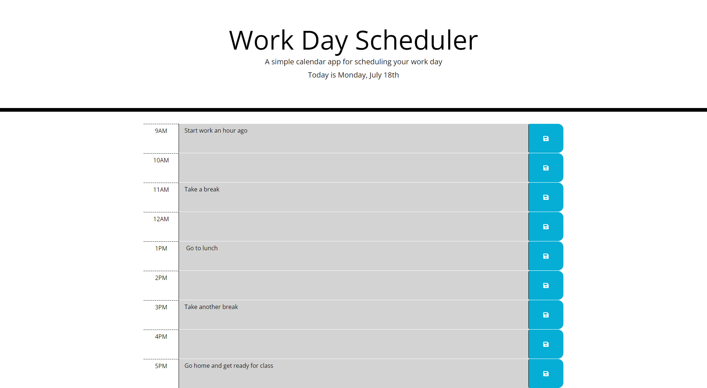

# Work Day Scheduler

<!-- ABOUT THE PROJECT -->
## About The Project

For the fifth challenge, `Work Day Scheduler` I took the provided code and turned it into a functional scheduler using `JavaScript` and `JQuery` mostly. Getting the current date set up was simple and I had the idea to use military time to track what hour it was instead of keeping track of if the time was in the AM or PM which I think sounded hard. Working with font awesome was cool but it was also confusing getting it to work. The hardest part was pulling the information down from `local storage` and putting that information into the correct time block `textarea` but eventually I got everything to work and I think it looks good. I used the previous activites, Zoom classes and Google to help for this challenge.

To use this scheduler, after the user types in the `textarea`, they can hit the blue save button which saves the text into `local storage`. After the user refreshes the page, that information is pulled into the correct time block and is displayed. The time blocks do change color depending on what time it is. `Grey` is for the past, `red` is for the present, and `green` is for the future. 

<!-- BUILT WITH -->
## Built With
<ul>
    <li> HTML
    <li> CSS
    <li> JavaScript
    <li> JQuery
    <li> Moment.js
</ul>

<!-- CONTACT ME -->
## Contact

Zachry Jorgensen - z.d.jorgensen@gmail.com

Project Link: [https://zdjorgensen.github.io/Work-Day-Scheduler/]

(<a href="#top">Back to Top</a>)
